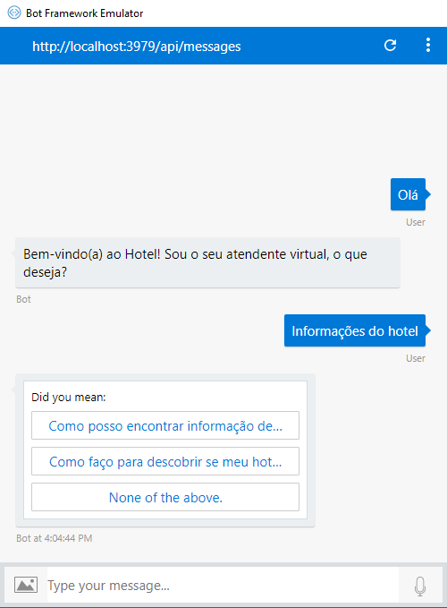

# HybridBot
Chatbot integrado ao LUIS e ao QnA Maker com Active Learning em um cenário híbrido

### Exemplo

Na imagem abaixo, a primeira resposta é proveniente do diálogo utilizando o LUIS. Já na segunda resposta (card) o fluxo de conversação foi direcionado para um diálogo que utiliza o QnA Maker com Active Learning.

